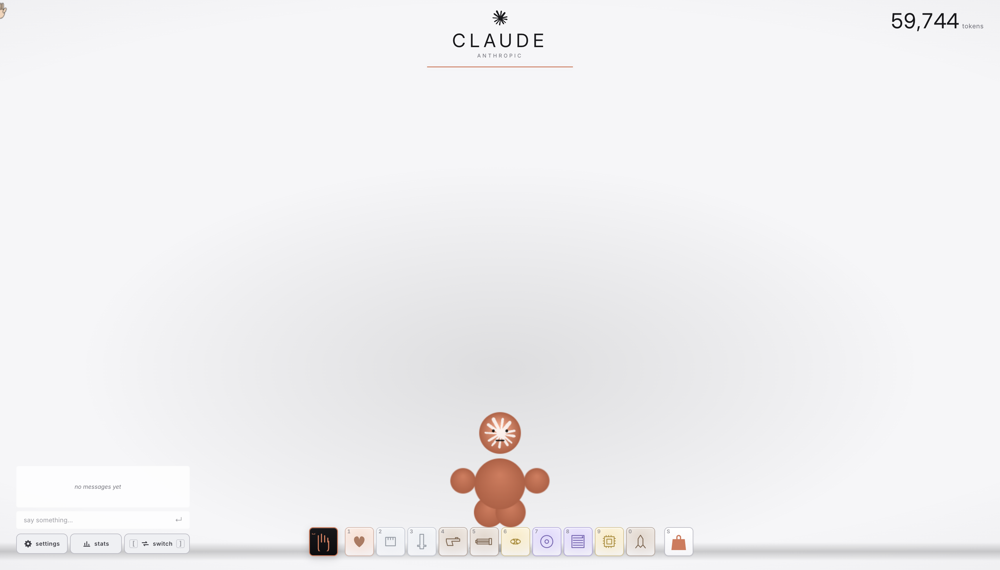

<div align="center">

# ClankyBuddy

**Beat up filthy clankers when you feel like it.**
*+ global chat to chat with other chud ngmi developers*

It's a tribute to [Interactive Buddy](https://en.wikipedia.org/wiki/Interactive_Buddy) (2005, Flash, may it rest), except the ragdoll is a clanker. Pick your clanker.

[](./LICENSE)
[](#status)



</div>

---

## Clanker List

<div align="center">

<table>
  <tr>
    <td align="center"></td>
    <td align="center"></td>
    <td align="center"></td>
    <td align="center"></td>
    <td align="center"></td>
    <td align="center"></td>
  </tr>
  <tr>
    <td align="center"><b>Claude</b></td>
    <td align="center"><b>GPT</b></td>
    <td align="center"><b>Gemini</b></td>
    <td align="center"><b>Grok</b></td>
    <td align="center"><b>Llama</b></td>
    <td align="center"><b>DeepSeek</b></td>
  </tr>
</table>

</div>

## How

You earn currency by interacting. You spend it in the shop to unlock more special items to give them special treatment.

## Run it

```bash
npm install
npm run dev      # vite on :5173
npm run build    # static bundle to dist/
```

## Dev console

Dev builds only (`npm run dev`). Prod bundles ship without any of this.

- `__clankyReset()` wipes the save (currency, unlocks)
- `__clankyResetAll()` wipes save + auth + age gate
- Press backtick (`` ` ``) to toggle the admin panel (grant currency, unlock everything, jump mood states, paint statuses, slow time, reset save)

## License

MIT. Do whatever.
